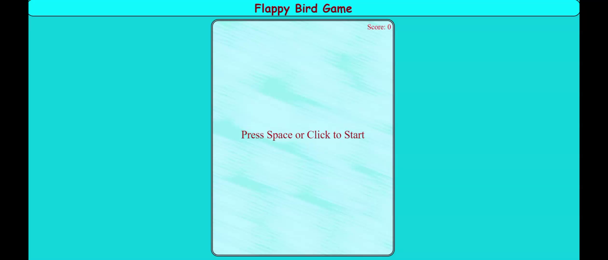
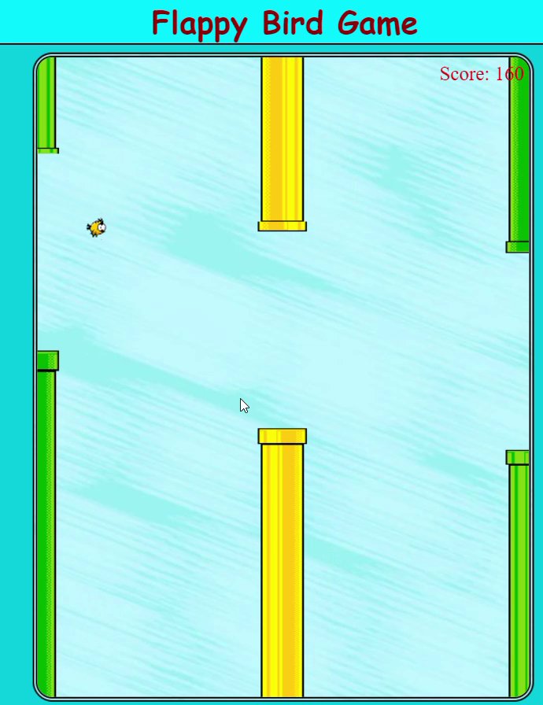
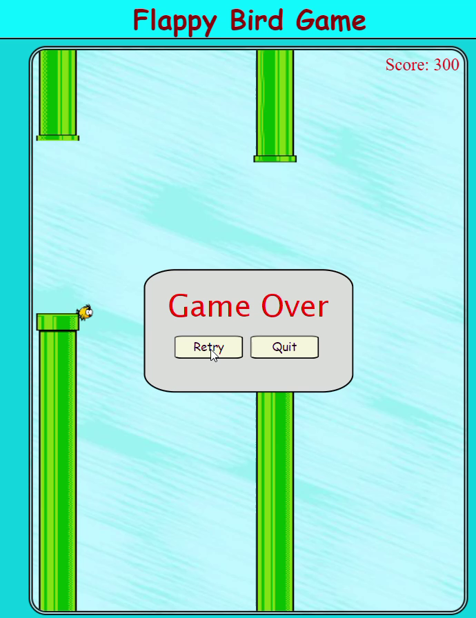
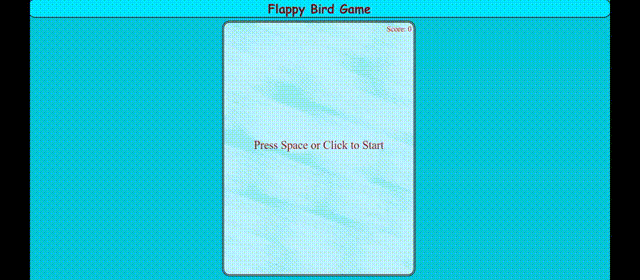

# Flappy Bird Game

## Table of Contents
1. [Project Description](#project-description)
2. [Technologies Used](#technologies-used)
3. [Features](#features)
4. [How to Run the Project](#how-to-run-the-project)
5. [How to Play](#how-to-play)
6. [Controls](#controls)
7. [Game Rules](#game-rules)
8. [Screenshots](#screenshots)
9. [Gameplay GIF](#gameplay-gif)

---

## Project Description

This project is a browser-based implementation of the classic **Flappy Bird** game, developed using **HTML**, **CSS**, and **JavaScript**. The goal of the game is to navigate a bird through pipes without hitting them. The game increases in difficulty as the speed and number of pipes increase.

## Technologies Used

- **HTML**: For structuring the content and elements of the game.
- **CSS**: For styling the game canvas and adding aesthetic elements.
- **JavaScript**: For the game logic, controls, and animations.

## Features

- Collision detection between the bird and the pipes.
- Score tracking based on how long the player survives.
- Playable directly in the browser with no additional installations required.

## How to Run the Project

1. Clone this repository using Git:
    ```bash
    git clone https://github.com/yourusername/flappy-bird.git
    ```

2. Navigate into the project directory:
    ```bash
    cd flappy-bird
    ```

3. Open the `index.html` file in your browser to play the game:
    - Double-click the `index.html` file

4. Enjoy the game!

## How to Play

- Press the **Spacebar** or the **Up Arrow Key** or the **W Key** or the **Mouse Click** to make the bird jump.
- Navigate through the pipes without hitting them.
- Your score increases with each set of pipes you successfully pass through.

### Controls

- **Spacebar**: Jump the bird.
- **Up Arrow Key**: Jump the bird (alternative control).
- **Mouse Click**: Jump the bird (alternative control).
- **W Key**: Jump the bird (alternative control).

## Game Rules

1. **Objective**: Keep the bird flying by avoiding the pipes. The game ends if the bird collides with a pipe, the ground, or the ceiling.
   
2. **Scoring**: 
    - You gain 10 points for each set of green pipes you pass and 20 points for each set of golden pipes.
    - There are no penalties for missed jumps; however, you lose if you hit a pipe or fall to the ground.

3. **Game Over**:
    - The game is over when the bird hits a pipe or falls to the ground or hits the ceiling.
    - After game over, you can restart by refreshing the page or clicking the restart button.
  
## Screenshots

### Game Start Screen



### In-Game Screenshot



### Game Over Screen



## Gameplay GIF



---

